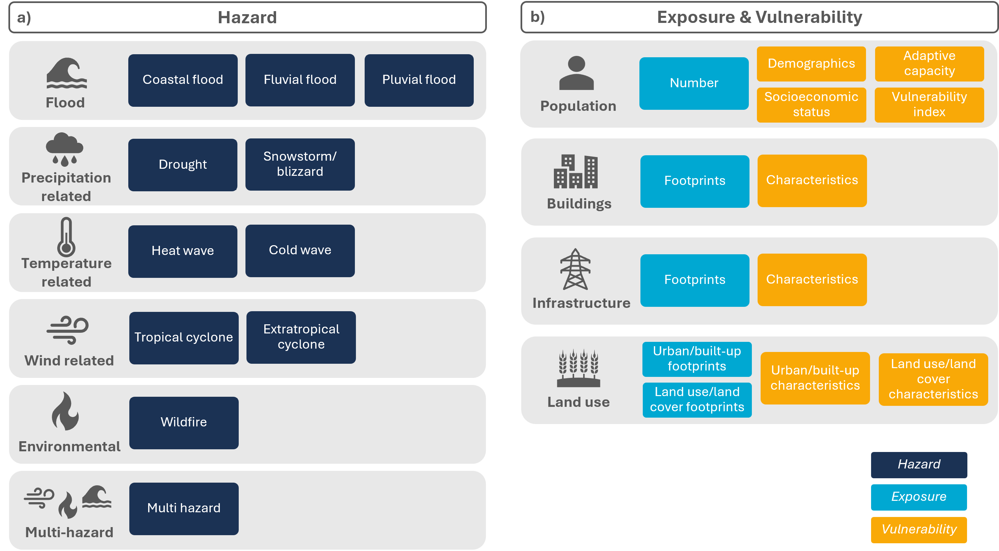

# Introduction

In this repository, a metadata catalog of datasets for climate risk assessments (CRA) is assembled, 
implemented in the SpatioTemporal Asset Catalog (STAC) specification and browsable in the STAC browser. 

STAC Browser: 
`explore the catalog <https://radiantearth.github.io/stac-browser/#/external/raw.githubusercontent.com/DirkEilander/climate-risk-stac/main/stac/catalog.json>`_

The current version of the catalog includes hazard, exposure and vulnerbility datasets, which are grouped into climate processes (i.e. hazards) and socioeconomic processes (i.e. exposure and vulnerability). 

   

   Catalog structure along the three risk drivers, separated into a) climate processes (i.e. hazards) and b) socioeconomic processes (i.e. exposure and vulnerability)
   
